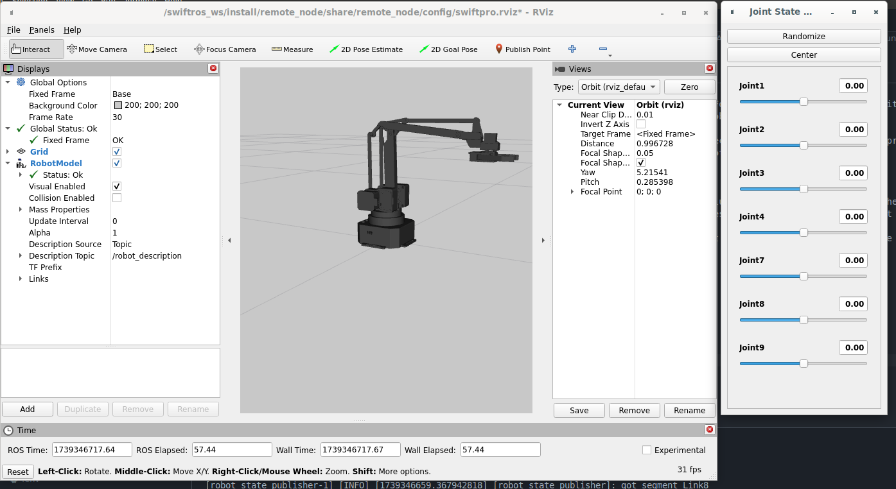

## Setup

### Step 1: Use the F***ing Container  

Before doing anything else, **build the container**. If you’re not using the container, you’re making your life unnecessarily difficult. **Seriously, use it.**  

Why? Because ROS 2 is a sprawling mess of interdependent libraries, and installing everything directly on your machine is a recipe for polluting your system beyond repair. **Running ROS 2 outside of a container is a bad idea.** Full stop.  

Luckily, there’s an easy solution: Containers - and we're using **Docker**. The project includes a well-structured container setup with:  
- A **Dockerfile** (found in `src/Dockerfile`)  with a `src/docker-compose.yml` to help you properly use the Docker image.  
- A **VS Code Dev Container** configuration (`src/.devcontainer/devcontainer.json`) for painless use of the Container within VSCode.

This setup allows you to develop in an isolated, controlled environment with all dependencies preconfigured. **Use it, or enjoy debugging dependency hell.**  

For reference, this container approach is inspired by the genius work found here: [ssilenzi/devcontainer-humble-ros-base](https://github.com/ssilenzi/devcontainer-humble-ros-base).  

## Docker Container Installation
Please see this outstanding reference, for a general understandng of how to set up a Docker container.
I am sure you can translate those instructions to this project quite easily.

[Franka Robotics - franks_ros2/README.md](https://github.com/frankaemika/franka_ros2?tab=readme-ov-file#docker-container-installation)

# Build the project
Once your environment is set up properly (probably within a running container), you will need to perform a build.
This is quite simple, using the following commands:

```
# Source the ros environment
source /opt/ros/humble/setup.bash
```

```
# build the project
colcon build --symlink-install
```
```
# source the project specific environment
source install/setup.bash
```

# Test the Basics
# Visualizing the UArm Swift Pro in RViz  

Before doing anything else, let’s make sure we can **see** the robot in a visualizer.  

For **ROS 2**, the default visualization tool is **RViz**. Fortunately, we don’t even need to run any of our own nodes to get started. The goal here is simple:  
- Verify that RViz can render a graphical representation of the **UArm Swift Pro**.  

UArm has already provided a **Xacro file** on their website, which I have copied into my source tree along with corresponding **mesh files** (also provided by UArm) to define the robot’s visual model.  

## Xacro to URDF Conversion  

Because writing raw **URDF** would apparently be too straightforward, ROS has **Xacro**—an XML macro language designed to make URDF more readable (or arguably, more convoluted). Here’s what happens:  

- **Xacro (XML Macros)** allow you to avoid repeating yourself while making the XML even harder to manually debug.  
- We use a **Xacro file** to construct a [URDF file](http://wiki.ros.org/urdf/XML/model) that describes the robot’s structure:  
  - **Links**: Define rigid bodies with mass, visual features, and collision properties.  
  - **Joints**: Define how links connect and move relative to each other.  
- The **Xacro file** (`src/remote_node/urdf/swiftpro.xacro`) references multiple [STL files](https://en.wikipedia.org/wiki/STL_(file_format)) for precise shape descriptions.  
- The `xacro` command processes all these references and **generates a complete URDF file**.  
- This happens automatically at build time via CMake (`src/remote_node/CMakeLists.txt`).  

At the end of all this, we get a **URDF file**, which is basically just the fully expanded version of the **Xacro file**—a process that *definitely* doesn’t add unnecessary complexity (except when it does).  

This modularity is great for tweaking shapes, colors, or adding dynamic elements—but let’s be real: **it’s also Yet Another Failure Point (YAFP)** in this already over-engineered ecosystem.  

## Now That We Have a URDF, Let’s Actually Use It  

We provide a **ROS 2 launch file**:  `src/remote_node/launch/view_robot_urdf.launch.py`

Because manually starting every single ROS 2 component one by one would be far too annoying, **launch files** help orchestrate everything into a single command.  

### What This Launch File Does  

  - **Starts `joint_state_publisher_gui`**  

     _Launches the joint_state_publisher node:_ The GUI node starts the `joint_state_publisher` in the background, which is responsible for reading joint states and publishing them to the /joint_states topic.  

     _Manual joint control in RViz:_ The GUI allows you to manually move the robot’s joints in the RViz visualization, providing an interactive way to test joint positions and visualize the robot’s movements without needing external controllers or scripts.

   - **Starts `robot_state_publisher`**  

     _Publishes robot_description:_ This node takes the URDF (Unified Robot Description Format) or Xacro file and loads it as a ROS 2 parameter. It then publishes this information as the robot_description topic, which is essential for describing the robot’s structure and kinematics.  

     _Necessity of this node:_ Although it might seem like an extra step, this node is necessary because it handles the processing of the robot’s description and transforms it into a format that can be used by other parts of the system, like robot_state_publisher and RViz.

   - **Launches `RViz` with a predefined config**  `src/remote_node/config/swiftpro.rviz`

     _Loading the RobotModel plugin:_ The configuration specifies that the Robot Model plugin is loaded, subscribes to the /joint_states topic from joint_state_publisher and /robot_description from robot_state_publisher, then updates the visualization of the robot based on these inputs.  

     _Visualization and interaction:_ The plugin allows RViz to display the robot’s joint states, so you can visually see how the robot’s joints move when interacting with it in RViz, providing a real-time feedback loop for testing and simulation.

### Running the Launch File  

```bash
ros2 launch remote_node view_robot_urdf.launch.py
```

Hopefully you are able to see something like this (click image to enlarge):  

<a href="InTheBeginning.png">
  
</a>

If you play around with the Joint settings on the Joint State Broadcaster GUI, you'll notice a problem.
Changing the joint values can "disassemble" the robot !

### Why URDF Doesn't Accommodate the UArm Swift Pro

URDF (Unified Robot Description Format) is designed for **serial kinematic chains** (simple arm models), not complex **parallel linkage** mechanisms like the UArm Swift Pro. 

Key reasons:
- **Joint Dependencies**: The UArm Swift Pro uses parallel linkages where joints are interdependent, which URDF can't model natively.
- **Mimic Joints**: While URDF’s `mimic` joints can handle some dependencies, they are too simple for the parallel kinematics in the UArm Swift Pro.
- **Complex Constraints**: Parallel linkages often require **custom constraints** that URDF doesn't support.

### Does that mean the SwiftPro sucks as a robot ?
While parallel linkage mechanisms are more complex to model, they do offer some benefits.

<small>  

### Parallel vs. Serial Linkage  
</small>  

- **Parallel Linkage**:
    - Higher **payload capacity** and **rigidity** due to load distribution across multiple arms.
    - Increased **stiffness** for heavy lifting and minimal deformation.
    - Compact design for high strength and precision.
  - **Drawbacks**:
    - More **complex control** due to interdependent joints.
    - **Limited flexibility** in motion range.

- **Serial Linkage (e.g., Franka FR3)**:
    - **Precision** and **dexterity** for fine control in intricate tasks.
    - **Versatile** with better range of motion and adaptability.
    - **Simpler control** algorithms with independent joint movement.
  - **Drawbacks**:
    - **Lower payload capacity** compared to parallel linkages.
    - Potential for **reduced stiffness** under heavy loads.


### What do we do now ?:
We would like to be able to properly visualize the Swift Pro. We could choose another visualizer, possibly Gazebo, or something even more sophisticated, but, then we wouldn't really learn much.  We could edit the XACRO file, adding in `mimic` joint entries - which you are encouraged to try - but, this **_still_** won't solve the issue properly, since `mimic` joints won't behave exactly as we need them to (i.e. correctly).

Example:
```bash
<joint name="Joint5" type="revolute">
	<axis xyz="0 1 0"/>
	<limit effort = "1000.0" lower = "-3" upper = "3" velocity = "0" />
    <parent link="Link1"/>
    <child link="Link5"/>
	<origin xyz= "-0.0215 0 0.05001" rpy = " 0 0 0" />
	<mimic joint="Joint2" multiplier="1.0" offset="-0.010"/>
</joint>
```
Joint2: A basic revolute joint between link1 and link2.
Joint5: Another revolute joint, but with a mimic entry.
The <mimic> tag tells URDF that Joint5 should mimic Joint2.
The multiplier="1.0" means the joint movement of joint5 will follow joint2 exactly.
The offset="-0.010" provides an angular offset between the two joints.

Of course, this might behave a little better than without 

The solution:

- A **Reported Joint State Publisher node** to publish the joint states as reported by the SwiftPro.  
or  
- A **Kinematics (IK) - or Reverse Kinematics - node** to publish the calculated the joint positions.

We could combine these into a single node, but the responsibilities are different.

Since we're currently looking at the visualization without requiring a physical robot, let's start with the [Kinematics Node](KinematicsNode.md).

