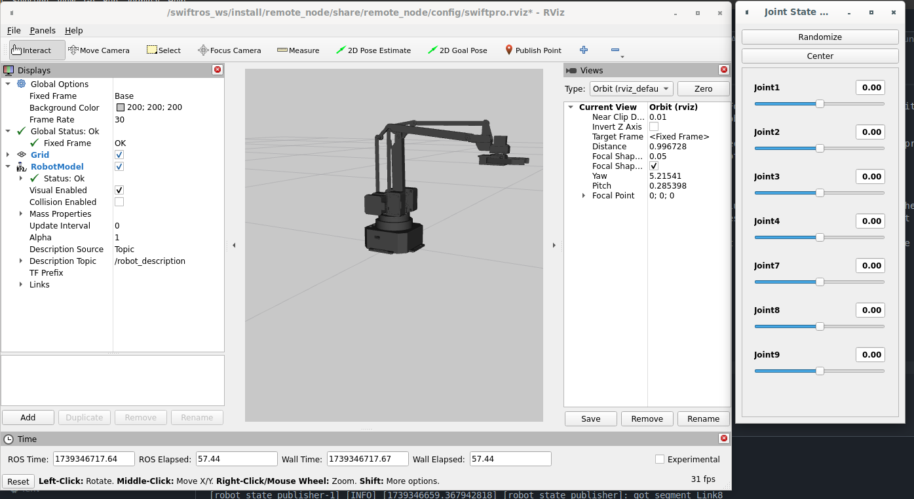

# Getting Started

## Step 1: Use the Container (Seriously)

Before doing anything else, **build the container**. If you're not using the
container, you're making your life unnecessarily difficult.

Why? Because ROS2 is a sprawling mess of interdependent libraries, and installing
everything directly on your machine is a recipe for polluting your system beyond
repair. **Running ROS2 outside of a container on your development machine is a
bad idea.** Full stop.

This project uses **Podman** — a daemonless, rootless Docker-compatible container
runtime. If you're coming from Docker, the commands are nearly identical. If
you're new to containers, just follow along.

## Step 2: Prerequisites

Install Podman and podman-compose:
```bash
# Fedora/RHEL
sudo dnf install -y podman podman-compose

# Ubuntu/Debian
sudo apt-get install -y podman podman-compose
```

Install avahi for ROS2 cross-machine discovery:
```bash
# Fedora/RHEL
sudo dnf install -y avahi
sudo systemctl enable --now avahi-daemon

# Ubuntu/Debian
sudo apt-get install -y avahi-daemon
sudo systemctl enable --now avahi-daemon
```

## Step 3: Clone the Repository
```bash
git clone https://github.com/Smit-tay/SwiftRos2.git
cd SwiftRos2
```

## Step 4: Create the Environment File
```bash
echo -e "UID=$(id -u)\nGID=$(id -g)\nUSERNAME=$(whoami)" > .env
```

## Step 5: Build and Start the Container
```bash
podman-compose up -d --build
```

## Step 6: Build the Project
```bash
podman exec topicfs bash -c \
    "cd /home/$(whoami)/dev/smithjack.net/SwiftRos2 && \
     source /opt/ros/jazzy/setup.bash && \
     colcon build --cmake-args -DCMAKE_EXPORT_COMPILE_COMMANDS=ON"
```

## Step 7: Source the Environment
```bash
source install/setup.bash
```

---

# Visualizing the UArm Swift Pro in RViz

Before connecting to a physical robot, let's make sure we can **see** it.
The goal here is simple — verify that RViz can render the UArm Swift Pro correctly.

## URDF and Xacro

UFactory provides a Xacro file and mesh files (STL) describing the robot's
visual model. Xacro is an XML macro language that generates URDF at build time.

URDF describes a robot as:
- **Links** — rigid bodies with mass, visual features, and collision properties
- **Joints** — how links connect and move relative to each other

The Xacro file (`swiftpro_resources/urdf/swiftpro.xacro`) references STL mesh
files and generates a complete URDF automatically at build time via CMake.

It adds complexity. It also adds modularity. Both statements are true.

## Running the Visualizer
```bash
source install/setup.bash
ros2 launch swiftpro_resources view_robot_urdf.launch.py
```

This launch file starts:

- **joint_state_publisher_gui** — lets you manually move joints via sliders,
  publishing to `/joint_states`
- **robot_state_publisher** — reads the URDF and publishes `/robot_description`
  and TF transforms
- **RViz** — visualizes the robot using the above

You should see something like this:



## The Problem

Play with the joint sliders. The robot disassembles itself.

This is not a bug in RViz or joint_state_publisher. It's a fundamental limitation
of URDF — it only supports serial kinematic chains. The UArm Swift Pro uses a
**parallel linkage mechanism** where joints are mechanically interdependent.
URDF cannot model this natively.

### Why URDF Can't Describe the UArm Swift Pro

- **Joint dependencies** — parallel linkages have joints whose positions are
  determined by other joints. URDF has no concept of this.
- **Passive joints** — some joints have no direct actuator. Their position is
  driven entirely by the geometry of the linkage. URDF's `mimic` tag gets close
  but doesn't handle the full constraint correctly.
- **Closed kinematic chains** — URDF assumes an open tree structure. The parallel
  linkage forms a closed loop. URDF simply cannot represent this.

### Does This Mean the UArm Swift Pro is a Bad Robot?

No. Parallel linkages are a legitimate design choice with real advantages:

**Parallel linkage:**
- Higher payload capacity and rigidity — load is distributed across multiple arms
- Increased stiffness — less deformation under load
- Compact design

**Serial linkage (e.g. Franka FR3):**
- Greater range of motion and dexterity
- Simpler kinematics
- Lower payload capacity

The UArm Swift Pro trades flexibility for rigidity. For pick-and-place tasks
with small objects, that's a reasonable tradeoff.

### What Do We Do About It?

We need a node that understands the parallel linkage geometry and publishes
correct TF transforms for all links based on the joints that are actually
actuated. This is the kinematics node.

See [KinematicsNode.md](KinematicsNode.md).
